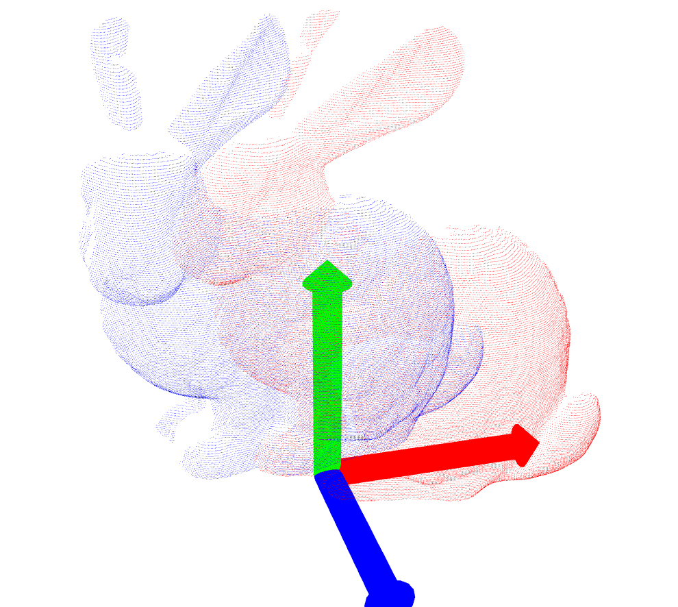
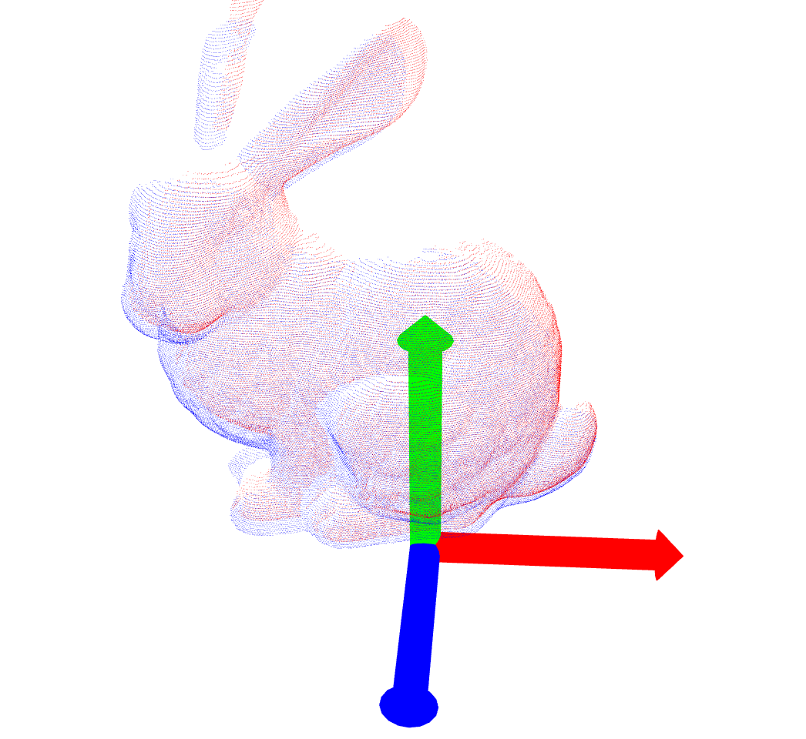
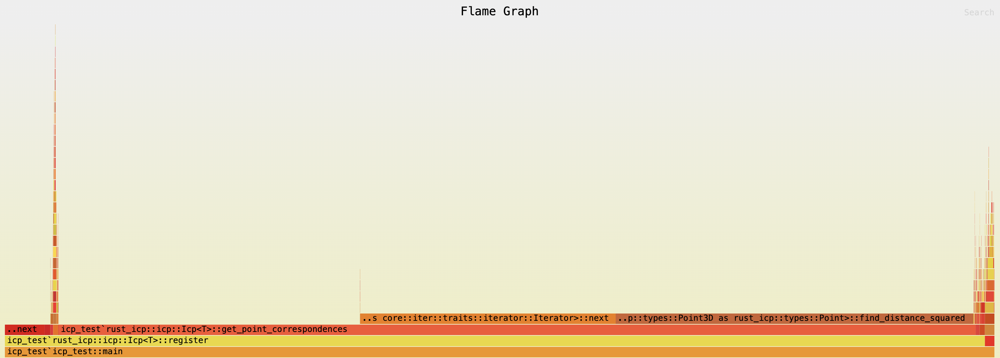

### Results
All experiments use bun000.ply as the model data file and initial transformation as identity

| Target Data File     | Before ICP       | After ICP        | Transformation & Iterations |
|---------------------|------------------------|------------------------|-------------------------------------|
| bun045.ply   |  |    | `[-0.054025605, 0.008519982,  -0.02015043, 0.95982087 − (0.04597068, 0.27673486, -0.0069616223)]` (19) |

### Flamegraph
cargo flamegraph --dev --root

### Preliminaries
#### Matrices
* Is a function which takes in an input and gives an output
* Usually applies a "transformation" to the input
* Can also be a composition of sequential transformations

#### Projection transformation
* A matrix which when multiplied to any vector projects that vector to its closest point on a particular subspace
* By virtue it also compresses the vector to a lower dimension

#### Matrix inverse
* The matrix which applies the opposite transformation to the original matrix
* Unfortunately this isnt unique

#### Transposing a matrix
* Transpose of a symmetric matrix is the symmetric matrix itself
* Transpose of a orthagonal matrix is the orthogonal matrix inverse so rotation in the opposite direction
* Transposing a rectangular matrix gives us switched dimensions

#### Eigenvectors/ Eigenvalues of matrix
* Vector which only gets scaled after matrix transformation but maintains direction
* Eigen value is the scaling constant for the eigen vector
* Intuitively they point in the direction of most significant variation

#### Diagonal matrices
* Diagonal matrices scale a vector uniformly in all directions without rotating or changing direction of the vector
* Special case: Identity matrix which scales everything by 1

#### Rectangular matrices
* Rectangular matrices can add or subtract a dimension when applied to a vector

#### Symmetric matrices
* Special property that eigen vectors are orthogonal
* So if we take eigen vectors and put them into a matrix then transpose of that transforms eigen vectors to align with standard basis
* If we dont take transpose that matrix transforms standard basis to eigen vectors

#### AA^T
* This gives us a symmetric matrix from a non symmetric matrix

#### Singular value decomposition
* AA^T is the left symmetrix matrix S_L and A^TA is the right symmetrix matrix S_R
* Eigen vectors of S_L are called left singular vectors and a matrix of those eigen vectors is called the left singular matrix
* Eigen vectors of S_R are called right singular vectors and a matrix of those eigen vectors is called right singular matrix
* Square root of those eigen values of the above eigen vectors are called singular values of the original matrix A
* Singular value decomposition: Any matrix can be represented as a matrix multiplication of three special matrices where 1st and 3rd are orthonagonal matrices (composed of the singular vectors) which cause rotation but second matrix is diagonal (composed of the singular values) and causes stretching
* Intuitively we are rotating the eigen vectors to align with standard basis and then the diagonal rectangular matrix is the dimension eraser which is removing a dimension (not always sometimes it just causes stretching, depends on if the original matrix is reactangular or not) and then we are rotating it back to align with the eigen vectors
* Goal of SVD is to decompose a transformation into the above three sequential actions

### Iterative Closest point
#### Setup
* Assume two sets of points X and Y with unknown correspondences
* Points are noisy so no perfect alignment exists
* Find the rotation R and translation t between the two points such that Min(Sum(Yn - (Xn*R+t))

#### Algorithm
* Guess initial transformation
* Find closest point correspondences
* Find optimal rotation and translation to min the sum of squared error
* Shift the point cloud and repeat these steps until satisfied

#### Questions
1. To find rotation and translation between known sets of corresponding points why cant we just use a matrix inverse?
* For two transformations which consists of rotation and translation, we can just do matrix inverse to find the relative transformation
* For two sets of points thats not possible because points themselves dont have a rotation, we want to find a Ax + t which minimises the squared error between them
* Thats why we need a cross covariance matrix and the SVD of that to estimate the rotation

### References
* https://youtube.com/@visualkernel/videos
* https://people.eecs.berkeley.edu/~pabbeel/cs287-fa11/slides/perception-for-robotics-instance-detection.pdf
* https://www.youtube.com/watch?v=dhzLQfDBx2Q
